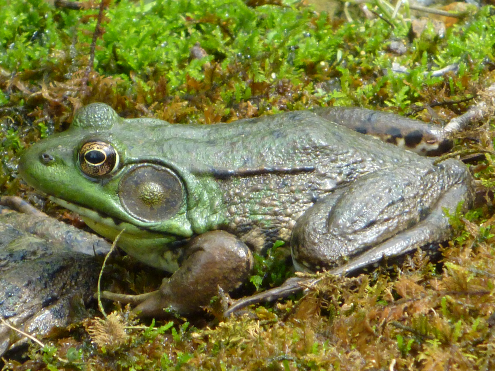
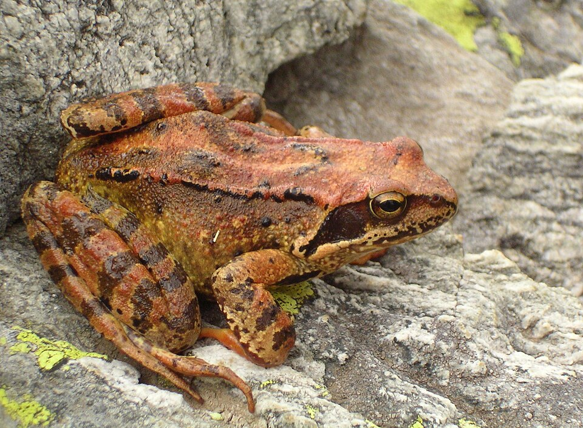
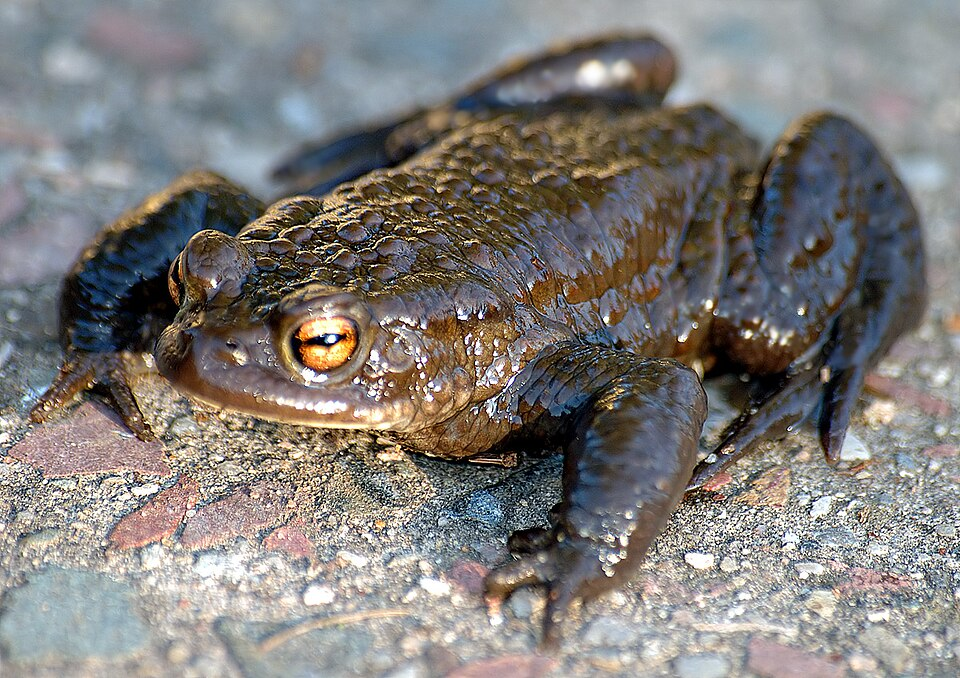
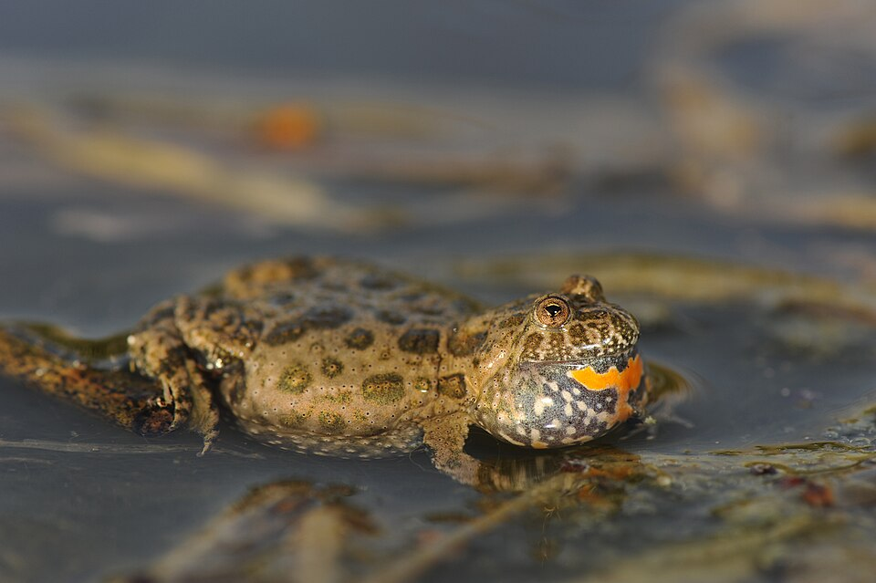
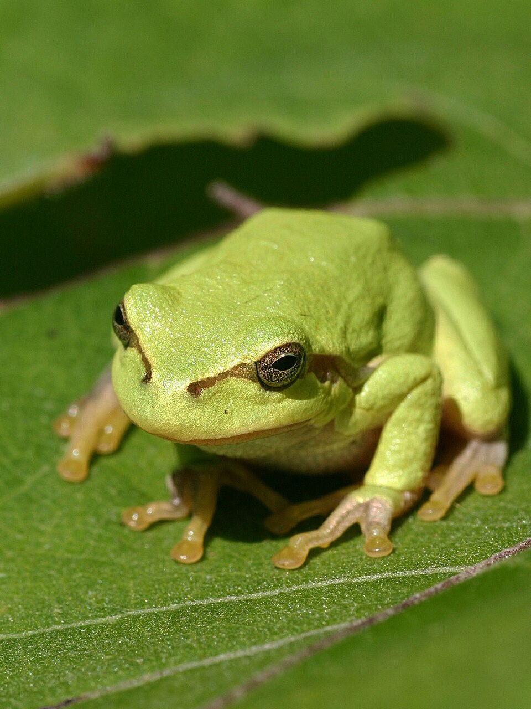

```{r setup-et-import, message=FALSE, warning=FALSE}
# Load libraries
library(tidyverse)
library(car)
library(vegan)
library(corrplot)
library(lme4)
library(broom)       # tidy() est utilisé dans le chapitre 2
library(rcompanion)  # cramerV() est utilisé dans le chapitre 3
library(patchwork)
library(broom)

# Import dataset
data <- read.csv("Data/Dataset_Amphibiens.csv", skip = 1, header = TRUE)
```

## Introduction
<Description jeu données>

### Apprendre plus sur les espèces étudiées
Retrouvez ci-dessous les fiches synthétiques des espèces analysées dans cette étude. Choisissez une espèce dans la liste pour consulter sa description et sa photo.

```{=html}
<style>
  .esp-menu { border: 1px solid #ddd; border-radius: 8px; padding: 1rem; margin: 1rem 0; }
  .esp-menu select { padding: .4rem; font-size: 1rem; margin-bottom: 1rem; }
  .esp-fiche { display: none; gap: 1.5rem; align-items: flex-start; }
  .esp-fiche.actif {display: block;align-items: flex-start;gap: 1.5rem;}
  .esp-fiche img {max-width: 250px;width: 250px;border-radius: 6px;}
  .esp-fiche h3 { font-size: 1.1rem; margin-bottom: 0.4rem; }
  .esp-fiche p { font-size: 0.85rem; line-height: 1.4; }
  .esp-fiche .credit { font-size: 0.7rem; color: #777; margin-top: 0.3rem; }
  @media (max-width: 700px) { .esp-fiche.actif { flex-direction: column; } .esp-fiche img { width: 100%; max-width: none; } }
</style>

<div class="esp-menu">
  <label for="choix-espece"><strong>Choisissez une espèce :</strong></label><br>
  <select id="choix-espece">
    <option value="">-- Sélectionner --</option>
    <option value="green-frogs">Grenouille verte (Green frogs)</option>
    <option value="brown-frogs">Grenouille rousse (Brown frogs)</option>
    <option value="common-toad">Crapaud commun (Common toad)</option>
    <option value="fire-bellied-toad">Crapaud sonneur (Fire-bellied toad)</option>
    <option value="tree-frog">Rainette arboricole (Tree frog)</option>
    <option value="common-newt">Triton commun (Common newt)</option>
    <option value="great-crested-newt">Triton crêté (Great crested newt)</option>
  </select>

  <!-- ===== FICHE : GRENOUILLE VERTE (exemple) ===== -->
<div class="esp-fiche" id="green-frogs">
<div style="display:flex; gap:20px; align-items:flex-start;">
  <div>
    
    <p class="credit">
      Par <a href="//commons.wikimedia.org/w/index.php?title=User:Contrabaroness&action=edit&redlink=1">Contrabaroness</a> —
      Travail personnel, <a href="http://creativecommons.org/publicdomain/zero/1.0/deed.en">CC0</a>,
      <a href="https://commons.wikimedia.org/w/index.php?curid=15268023">Lien</a>
    </p>
  </div>
  <div>
    <h3>Grenouille verte <em>(Pelophylax spp.)</em></h3>
    <p>Amphibien très aquatique, de 6 à 12 cm, au dos vert à brun marqué de taches
    sombres, souvent avec une ligne claire dorsale. On la trouve toute l'année
    dans ou près des plans d'eau, et les mâles chantent au printemps et en été.</p>
  </div>
</div>
</div>

  <!-- ===== FICHE : GRENOUILLES BRUNES ===== -->
<div class="esp-fiche" id="brown-frogs">
<div style="display:flex; gap:20px; align-items:flex-start; margin-bottom:30px;">
  <div>
    
    <p class="credit">
      Par <a href="https://commons.wikimedia.org/wiki/User:LivingShadow">LivingShadow</a> —
      Travail personnel, <a href="http://creativecommons.org/publicdomain/zero/1.0/deed.en">CC0</a>,
      <a href="https://commons.wikimedia.org/w/index.php?curid=15268023">Lien</a>
    </p>
  </div>

  <div>
    <h3>Grenouille rousse <em>(Rana temporaria)</em></h3>
    <p>La grenouille rousse est une espèce commune des milieux humides,
      des prairies et des forêts. Son corps est trapu et sa couleur varie
      du brun clair au brun foncé. Elle mesure généralement entre 5 et 10 cm.</p>
  </div>
</div>

<div style="display:flex; gap:20px; align-items:flex-start;">
  <div>
    
    <p class="credit">
      Par <a href="https://commons.wikimedia.org/w/index.php?title=User:Heston_Benstead&action=edit&redlink=1">Heston_Benstead</a> —
      Travail personnel, <a href="http://creativecommons.org/publicdomain/zero/1.0/deed.en">CC0</a>,
      <a href="https://commons.wikimedia.org/w/index.php?curid=15268023">Lien</a>
    </p>
  </div>

  <div>
    <h3>Grenouille agile <em>(Rana dalmatina)</em></h3>
    <p>Plus élancée que la grenouille rousse, la grenouille agile possède
      de longues pattes arrière qui lui permettent de réaliser de grands sauts.
      Elle fréquente surtout les bois et les lisières forestières.</p>
  </div>
</div>
</div>


  <!-- ===== FICHE : CRAPAUD COMMUN ===== -->
<div class="esp-fiche" id="common-toad">
<div style="display:flex; gap:20px; align-items:flex-start;">
  <div>
    
    <p class="credit">
      Par <a href="/https://commons.wikimedia.org/wiki/User:Aka">Aka</a> —
      Travail personnel, <a href="http://creativecommons.org/publicdomain/zero/1.0/deed.en">CC0</a>,
      <a href="https://commons.wikimedia.org/w/index.php?curid=15268023">Lien</a>
    </p>
  </div>
  <div>
      <h3>Crapaud commun <em>(Bufo bufo)</em></h3>
      <p>Le crapaud commun est un amphibien robuste et trapu, se nourrit principalement d'escargots, de vers de terre ou autres petits insectes. Il vit dans les zones humides (étangs, mares, sous-bois).</p>
  </div>
</div>
</div>

  <!-- ===== FICHE : CRAPAUD SONNEUR ===== -->
<div class="esp-fiche" id="fire-bellied-toad">
<div style="display:flex; gap:20px; align-items:flex-start;">
  <div>
    
    <p class="credit">
      Par <a href="//commons.wikimedia.org/wiki/User:Benny_Trapp" title="User:Benny Trapp">Benny Trapp</a> —
      Travail personnel, <a href="https://creativecommons.org/licenses/by-sa/3.0" title="Creative Commons Attribution-Share Alike 3.0">CC BY-SA 3.0</a>,
      <a href="https://commons.wikimedia.org/w/index.php?curid=18794203">Lien</a>
    </p>
  </div>
  <div>
      <h3>Crapaud sonneur <em>(Bombina spp.)</em></h3>
      <p>Les Bombina spp., communément appelés les crapauds sonneurs,
      forment un genre de petits amphibiens de la famille des Bombinatoridae.
      Bien qu'on les appelle "crapauds", ils possèdent des caractéristiques biologiques
      uniques qui les distinguent à la fois des vrais crapauds et des grenouilles.</p>
  </div>
</div>
</div>

  <!-- ===== FICHE : RAINETTE ARBORICOLE ===== -->
<div class="esp-fiche" id="tree-frog">
<div style="display:flex; gap:20px; align-items:flex-start;">
  <div>
    
    <p class="credit">
      Par <a href="https://de.wikipedia.org/wiki/User:Christoph_Leeb" class="extiw" title="de:User:Christoph Leeb">Christoph Leeb</a> —
      Travail personnel, <a href="http://creativecommons.org/licenses/by-sa/3.0/" title="Creative Commons Attribution-Share Alike 3.0">CC BY-SA 3.0</a>,
      <a href="https://commons.wikimedia.org/w/index.php?curid=4347533">Lien</a>
    </p>
  </div>
  <div>
      <h3>Rainette arboricole <em>(Hyla arborea)</em></h3>
      <p>Hyla arborea, communément appelée la Rainette verte, 
      est sans doute l'un des amphibiens les plus élégants d'Europe. 
      Contrairement aux grenouilles vertes classiques (Pelophylax), 
      elle appartient à la famille des Hylidae. 
      Elle possède un mode de vie presque exclusivement arboricole.</p>
  </div>
</div>
</div>

  <!-- ===== FICHE : TRITON COMMUN ===== -->
<div class="esp-fiche" id="common-newt">
<div style="display:flex; gap:20px; align-items:flex-start;">
  <div>
    
    <p class="credit">
      Par <a href="//commons.wikimedia.org/w/index.php?title=User:Contrabaroness&action=edit&redlink=1">Contrabaroness</a> —
      Travail personnel, <a href="http://creativecommons.org/publicdomain/zero/1.0/deed.en">CC0</a>,
      <a href="https://commons.wikimedia.org/w/index.php?curid=15268023">Lien</a>
    </p>
  </div>
  <div>
      <h3>Triton commun</h3>
      <p>Texte à compléter...</p>
  </div>
</div>
</div>

  <!-- ===== FICHE : TRITON CRÊTÉ ===== -->
<div class="esp-fiche" id="great-crested-newt">
<div style="display:flex; gap:20px; align-items:flex-start;">
  <div>
    
    <p class="credit">
      Par <a href="//commons.wikimedia.org/w/index.php?title=User:Contrabaroness&action=edit&redlink=1">Contrabaroness</a> —
      Travail personnel, <a href="http://creativecommons.org/publicdomain/zero/1.0/deed.en">CC0</a>,
      <a href="https://commons.wikimedia.org/w/index.php?curid=15268023">Lien</a>
    </p>
  </div>
  <div>
      <h3>Triton crêté</h3>
      <p>Texte à compléter...</p>
  </div>
</div>
</div>

<script>
  document.getElementById("choix-espece").addEventListener("change", function () {
    document.querySelectorAll(".esp-fiche").forEach(f => f.classList.remove("actif"));
    if (this.value) document.getElementById(this.value).classList.add("actif");
  });
</script>
```

## Analyse de la diversité des communautés d'amphibiens
### Diversité alpha : abondance et richesse spécifique
La diversité alpha décrit la diversité locale des communautés en termes
de richesse spécifique. Afin de comparer les communautés d'amphibiens
associées aux autoroutes A1 et S52, une analyse de la diversité alpha a
été réalisée à partir des données de présence-absence des espèces (@fig-chp1-diversité_alpha).

```{r diversité alpha, echo=FALSE, message=FALSE, warning=FALSE}
diversite_alpha = data[-1,-c(1,3:16)]
colnames(diversite_alpha)[1] = "Autoroutes"

diversite_alpha_long <- diversite_alpha %>%
  pivot_longer(cols = -Autoroutes,
               names_to = "Especes",
               values_to = "Presence")

diversite_alpha_resume <- diversite_alpha_long %>%
  group_by(Autoroutes, Especes) %>%
  summarise(Nb_amphibiens = sum(Presence, na.rm = TRUE),
            .groups = "drop")

ordre_s52 <- diversite_alpha_resume %>%
  filter(Autoroutes == "S52") %>%
  arrange(desc(Nb_amphibiens)) %>%
  pull(Especes)

diversite_alpha_resume <- diversite_alpha_resume %>%
  mutate(Especes = factor(Especes, levels = ordre_s52))

```

```{r}
#| label: fig-chp1-diversité_alpha
#| fig-cap: "Abondance des différentes espèces d'amphibiens recensées le long des autoroutes A1 et S52."
#| echo: false
#| warning: false
#| message: false
ggplot(diversite_alpha_resume,
       aes(x = Especes,
           y = Nb_amphibiens,
           fill = Autoroutes)) +
  geom_col(position = position_dodge(width = 0.8)) +
  scale_fill_manual(
    values = c(
      "S52" = "#A8D5E2",
      "A1" = "#F4B183"
    )) +
  scale_y_continuous(
    breaks = seq(0, 140, by = 20)
  ) +
  labs(
    x = "Espèces",
    y = "Nombre d'individus",
    fill = "Autoroute"
  ) +
  theme_classic() +
  theme(
    axis.text.x = element_text(angle = 45, hjust = 1, size = 13),
    axis.text.y = element_text(size = 13),
    axis.title.x = element_text(size = 16, face = "bold"),
    axis.title.y = element_text(size = 16, face = "bold"),
    panel.grid.major.y = element_line(color = "grey85", linewidth = 0.5),
    panel.grid.minor.y = element_blank(),
    legend.position = "top"
  )

```

La répartition des observations met en évidence des abondances plus élevées le long de l'autoroute S52 que sur l'autoroute A1 pour l'ensemble des espèces étudiées (@fig-chp1-diversité_alpha). Les grenouilles brunes constituent le taxon le plus fréquemment observé sur les deux sites, tandis que le triton crêté apparaît comme l'espèce la plus rare.

Malgré ces différences quantitatives, le classement relatif des espèces reste globalement similaire entre les deux autoroutes. Cette tendance suggère que les communautés présentes le long de l'A1 et de la S52 partagent une composition spécifique comparable, mais que les populations semblent plus abondantes sur la S52. Plusieurs facteurs peuvent expliquer ce résultat, notamment une qualité d'habitat plus favorable, une meilleure connectivité écologique ou encore des différences dans les conditions d'échantillonnage. Des analyses statistiques complémentaires seraient toutefois nécessaires afin de déterminer si ces écarts sont significatifs.

### Diversité bêta : similitude des communautés entre autoroutes
Si la diversité alpha permet de caractériser les communautés localement, elle ne renseigne pas sur le degré de similitude entre les assemblages observés. Afin d'évaluer les différences de composition spécifique entre les relevés effectués sur les deux autoroutes, une analyse de la diversité bêta a été réalisée à partir des distances de Jaccard calculées sur les données de présence-absence (@fig-chp1-diversité_beta).

```{r diversité beta, echo=FALSE, message=FALSE, warning=FALSE, results='hide',fig.show='asis'}
especes <- diversite_alpha[, -1] # colonnes espèces
autoroute <- diversite_alpha$Autoroutes

dist_jaccard <- vegdist(especes,
                        method = "jaccard",
                        binary = TRUE)
keep <- rowSums(especes) > 0

especes2 <- especes[keep, ]
autoroute2 <- autoroute[keep]
nmds <- metaMDS(
  especes2,
  distance = "jaccard",
  k = 2,
  trymax = 100
)
nmds_data <- as.data.frame(nmds$points)
nmds_data$Autoroutes <- autoroute2
```

```{r}
#| label: fig-chp1-diversité_beta
#| fig-cap: "Ordination NMDS illustrant les différences de composition des communautés d'amphibiens recensées le long des autoroutes A1 et S52."
#| echo: false
#| warning: false
#| message: false
ggplot(nmds_data,
aes(MDS1, MDS2, color = Autoroutes)) +
geom_point(size = 3, alpha = 1) +
scale_color_manual(
values = c(
"S52" = "#A8D5E2",
"A1" = "#F4B183"
)
)
```

L'ordination NMDS obtenue à partir des distances de Jaccard montre un important chevauchement des relevés associés aux autoroutes A1 et S52 (@fig-chp1-diversité_beta). Les points représentant les deux groupes ne forment pas de clusters distincts, ce qui suggère une forte similarité dans la composition des communautés d'amphibiens.

Ainsi, bien que la diversité alpha ait mis en évidence des différences d'abondance entre les deux autoroutes, la diversité bêta indique que les espèces présentes sont globalement les mêmes. Les variations observées semblent donc principalement liées aux effectifs des espèces plutôt qu'à une modification de la composition spécifique des communautés.

## Préparation du jeu de donnée : corrélations des variables
```{r chapitre3-dataprep-a, echo = FALSE, warning = FALSE, message = FALSE}
data_amphi <- data %>% select((last_col() - 6):last_col())
data_var   <- data %>% select(3:(last_col() - 7))
```

Pour réaliser des modèles, il est nécessaire de préparer correctement le jeu de données. Il faut d'abord vérifier que toutes les espèces sont bien représentées dans l'ensemble du jeu de données, sans sous-représentation, puis écarter les sites où aucune espèce n'a été observée.

Toutes les espèces sont présentes, avec des fréquences d'occurrence allant de `r min(representation)` % à `r max(representation)` % comme indiqué dans @tbl-chp3-representation. En revanche, `r sum(!valid_sites)` sites ne comptent aucune observation : ils ont été supprimés, ce qui fait passer le jeu de données de `r nrow(data_var)` à `r nrow(data_var_clean)` lignes.

```{r}
#| label: tbl-chp3-representation
#| tbl-cap: "Fréquence d'occurrence de chaque espèce (pourcentage de sites occupés)."
#| echo: false
#| warning: false
#| message: false
# Sites sans aucune observation
valid_sites      <- rowSums(data_amphi) > 0
data_amphi_clean <- data_amphi[valid_sites, ]
data_var_clean   <- data_var[valid_sites, ]

# Fréquence d'occurrence de chaque espèce (% de sites occupés)
representation <- round(100 * colMeans(data_amphi != 0), 1)
knitr::kable(
  data.frame(`Espèce` = names(representation),
             `Sites occupés (%)` = representation,
             check.names = FALSE),
  row.names = FALSE, align = c("l", "c")
)
```

### Corrélations
Nous avons ensuite vérifié les corrélations entre variables explicatives afin d'éviter la multicolinéarité dans les modèles : corrélation de Spearman pour les variables numériques et ordinales, et V de Cramér pour les variables catégorielles. Dans les deux cas, le seuil de redondance retenu est de $0.60$.

```{r chapitre3-dataprep-c, echo = FALSE, warning = FALSE, message = FALSE}
# SEPARATION DU JEU DE DONNEES
## Variables numériques et ordinales
data_num_ord <- data_var_clean %>% select(SR, NR, OR, RR, BR)
## Variables catégorielles
data_cat <- data_var_clean %>%
  select(TR, VR, SUR1, SUR2, SUR3, UR, FR, MR, CR) %>%
  mutate(across(everything(), as.factor))
```

```{r chapitre3-cor-calc, echo = FALSE, warning = FALSE, message = FALSE}
## Corrélation des variables numériques et ordinales (Spearman)
cor_matrix_spearman <- cor(data_num_ord, use = "complete.obs", method = "spearman")

## Corrélation des variables catégorielles (V de Cramér)
cat_vars <- colnames(data_cat)
n_vars <- length(cat_vars)
cramer_matrix <- matrix(NA, nrow = n_vars, ncol = n_vars,
                        dimnames = list(cat_vars, cat_vars))
for (i in 1:n_vars) {
  for (j in 1:n_vars) {
    ct <- table(data_cat[[i]], data_cat[[j]])
    cramer_matrix[i, j] <- tryCatch(rcompanion::cramerV(ct),
                                    error = function(e) NA_real_)
  }
}
cramer_matrix <- as.matrix(cramer_matrix)
```

#### Corrélations et sélection des variables numériques
La matrice de corrélation de Spearman (@fig-chp3-cor-spearman) met en évidence une seule paire dépassant le seuil $|r| > 0.60$ : RR–BR. Une seule de ces deux variables a donc été conservée (@tbl-chp3-cor-num). Toutes les autres corrélations restent inférieures à $0.60$ en valeur absolue.

```{r}
#| label: fig-chp3-cor-spearman
#| fig-cap: "Matrice de corrélation de Spearman entre variables numériques."
#| echo: false
#| warning: false
#| message: false
corrplot::corrplot(cor_matrix_spearman, method = "color", type = "upper", addCoef.col = "black")
```

```{r}
#| label: tbl-chp3-cor-num
#| tbl-cap: "Variables corrélées (Spearman) et sélection des variables numériques. Sélection basée sur un seuil de corrélation |r| > 0.70 (test de Spearman via `cor.test`). Les p-values ont été vérifiées et ajustées."
#| echo: false
tab <- data.frame(
  `Paire` = c("**RR** (distance aux routes) et **BR** (distance aux bâtiments)"),
  `r` = c("$0.80$"),
  `p` = c("$100$"), #< METTRE BONNES VALEURS ICI @P !>
  `Lien écologique` = c("Routes et constructions sont associées dans les zones urbanisées et périurbaines."),
  `Conservée` = c("**RR**"),
  `Éliminée` = c("**BR**"),
  `Justification` = c("La mortalité routière des amphibiens est documentée, ce qui fait de `RR` un meilleur indicateur de pression anthropique [SOURCE]."),
  check.names = FALSE, stringsAsFactors = FALSE
)
knitr::kable(tab, align = c("l","c","l","c","c","l"))
```

#### Corrélations et sélection des variables catégorielles
La matrice des V de Cramér (@fig-chp3-cor-cramer) révèle deux associations supérieures à $0.60$ : MR–CR et UR–FR. Les variables retenues sont indiquées dans le @tbl-chp3-cor-cat.

```{r}
#| label: fig-chp3-cor-cramer
#| fig-cap: "Matrice des V de Cramér entre variables catégorielles."
#| echo: false
#| warning: false
#| message: false
corrplot::corrplot(cramer_matrix, method = "color", type = "upper",
                   addCoef.col = "black", tl.col = "black", tl.srt = 45)
```

```{r}
#| label: tbl-chp3-cor-cat
#| tbl-cap: "Variables associées (V de Cramér) et sélection des variables catégorielles. Association mesurée par le V de Cramér (issu du test du $\\chi^2$). Sélection basée sur un seuil $V > 0.60$ pour réduire la redondance entre variables catégorielles."
#| echo: false
tab <- data.frame(
  `Paire` = c("**MR** (état de maintenance) et **CR** (type de rive)", "**UR** (utilisation du réservoir) et **FR** (présence de pêche)"),
  `r` = c("$0.71$", "$0.64$"),
  `Lien écologique` = c("Les rives artificialisées (béton) vont souvent de pair avec des milieux plus modifiés ou urbanisés, où l'entretien et les dépôts de déchets posent problème.", "L'usage économique des plans d'eau implique souvent de la pisciculture, donc une pression de pêche élevée."),
  `Conservée` = c("**CR**", "**UR**"),
  `Éliminée` = c("**MR**", "**FR**"),
  `Justification` = c("Une rive verticale en béton empêche les amphibiens de sortir de l'eau : `CR` est donc un facteur écologique plus déterminant que l'état de propreté (`MR`).", "`UR` couvre une typologie plus large et intègre l'effet de la pêche tout en conservant d'autres types d'interactions humaines."),
  check.names = FALSE, stringsAsFactors = FALSE
)
knitr::kable(tab, align = c("l","c","l","c","c","l"))
```

Après cette sélection, les variables $BR$, $FR$ et $MR$ ont été écartées pour la suite de l'analyse. Il reste donc $SR$, $NR$, $OR$ et $RR$ pour les variables numériques et ordinales, et $TR$, $VR$, $SUR1$, $SUR2$, $SUR3$, $UR$ et $CR$ pour les variables catégorielles.

```{r chapitre3-drop-vars, echo = FALSE, warning = FALSE, message = FALSE}
# Variables éliminées
vars_num_drop <- c("BR")         # numériques / ordinales
vars_cat_drop <- c("MR", "FR")   # catégorielles

# Suppression dans les data frames
data_num_ord_sel <- data_num_ord[, !colnames(data_num_ord) %in% vars_num_drop, drop = FALSE]
data_cat_sel     <- data_cat[, !colnames(data_cat) %in% vars_cat_drop, drop = FALSE]

# Assemblage (les variables catégorielles restent des facteurs)
data_var_clean_cca <- cbind(data_num_ord_sel, data_cat_sel)
```

## Création des modèles pour étudier le jeu de donnée
### Analyse multivarié à deux tableaux
Avec ce même jeu de données, on se demande quelles variables structurent
la composition et la diversité globale de la communauté d'amphibiens.
Pour cela, une approche appropriée est l'analyse multivariée.

Les analyses multivariées permettent de... <!-- À COMPLÉTER -->
  
  Dans ce cas, ayant un jeu de données avec des informations sur la
présence/absence des amphibiens et des variables catégorielles et
numériques sur le contexte environnemental, une analyse canonique des
correspondances (CCA) devrait être réalisée.

```{r chapitre3-cca, echo = FALSE, warning = FALSE, message = FALSE}
set.seed(123)

# vegan::cca ne tolère pas les NA : on garde les sites complets
complets <- complete.cases(data_var_clean_cca)
data_amphi_cca <- data_amphi_clean[complets, ]
data_var_cca   <- droplevels(data_var_clean_cca[complets, ])

# 1. Analyse canonique des correspondances (CCA) avec les variables retenues
cca_model <- cca(data_amphi_cca ~ ., data = data_var_cca)

# Résumé du modèle (valeurs propres, variance expliquée, scores)
summary(cca_model)

# Test de significativité globale du modèle
anova(cca_model, permutations = 999)

# Test de significativité de chaque variable
anova(cca_model, by = "term", permutations = 999)
```

### Modele linéaire généralisé


#### Analyse de l'influence des activités humaines sur la présence des amphibiens

Nous cherchons à savoir si la présence des amphibiens est influencée par les activités anthropiques. Pour tester cette hypothèse, nous utilisons des modèles linéaires généralisés (GLM).

##### Sélection de variables explicatives

On va d'abord chercher à identifier les variables explicatives correspondantes à l'influence humaine sur les populations d'Amphibiens.

Les variables retenues pour notre analyse des pressions anthropiques sont les suivantes : - FR : importance de la pêche au sein des réservoirs - RR : distance minimale du réservoir aux routes - BR : distance minimale du réservoir aux buildings - MR : état du réservoir (propre, légèrement pollué, lourdement pollué) - CR : type de berge du réservoir (naturelle, bétonnée)

Avec la matrice de corrélation (@fig-chp3-cor-spearman & @fig-chp3-cor-cramer), on peut observer que les paramètres RR et BR ont une corrélation absolue supérieure à 0.7, on supprime donc le paramètre BR. Pour vérifier la distribution des données et repérer d'éventuels effectifs trop faibles par modalité, un diagramme de proportions a été réalisé pour chaque variable.


```{r répartiton-glm-influence-humaine, echo = FALSE, warning = FALSE, message = FALSE}

data_vars = data %>%
  select(CR, FR, MR, RR) %>%
  mutate(across(everything(), as.character)) %>%
  pivot_longer(everything(), names_to = "Variable", values_to = "Modalite")

data_pie = data_vars %>%
  filter(!is.na(Modalite)) %>%
  count(Variable, Modalite) %>%
  mutate(Modalite = factor(Modalite, levels = sort(as.numeric(unique(Modalite))))) %>%
  group_by(Variable) %>%
  mutate(
    Total = sum(n),
    Prop = n / Total,
    Pct = round(Prop * 100, 1),
    ymax = cumsum(Prop),
    ymin = c(0, head(ymax, length(ymax) - 1)),
    label_pos = (ymax + ymin) / 2
  )
```

<details>
<summary><strong>Répartition des variables explicatives</strong></summary>
  
  
```{r}
#| label: fig-répartition-glm-influence-humaine
#| fig-cap: "Répartition en pourcentages des variables explicatives."
#| echo: false
#| warning: false
#| message: false

ggplot(data_pie, aes(ymax = ymax, ymin = ymin, xmax = 4, xmin = 3, fill = Modalite)) +
  geom_rect(color = "white", linewidth = 1) +
  coord_polar(theta = "y") +
  xlim(c(2, 4)) + 
  facet_wrap(~ Variable, scales = "free") +
  geom_text(aes(x = 3.5, y = label_pos, label = ifelse(Pct > 3, paste0(Pct, "%"), "")), 
            color = "white", fontface = "bold", size = 3) +
  theme_void() +
  labs(
    title = "",
    fill = "Modalité"
  ) +
  theme(
    strip.text = element_text(face = "bold", size = 11),
    legend.position = "right",
    plot.title = element_text(hjust = 0.5, face = "bold"),
    plot.subtitle = element_text(hjust = 0.5)
  )
```

</details>
  
  On peut voir que les paramètres CR et MR (@fig-répartition-glm-influence-humaine) ont une modalité qui représente plus de 95% des valeurs, on les supprime alors.

##### Analyse de la pêche et de la distance minimale des routes sur les amphibiens

On établit alors le modèle suivant : 
  
$$\text{logit}(p_i) = \beta_0 + \beta_1 \text{FR}_i + \sum_{k} \beta_{\text{RR}_k} \cdot \mathbb{I}(\text{RR}_i = k)$$
  où :
  
- $p_i$ correspond à la probabilité de présence sur le site $i$ ;
- $\beta_0$ est l'ordonnée à l'origine du modèle ;
- $\beta_1$ représente l'effet de l'intensité de la pêche ($\text{FR}$) sur le log-odds de présence ;
- $\beta_{\text{RR}_k}$ représente l'effet spécifique de la classe $k$ de la distance aux routes ($\text{RR}$) par rapport à la classe de référence ;
- $\mathbb{I}(\text{RR}_i = k)$ est une fonction indicatrice qui vaut 1 si l'observation $i$ appartient à la classe $k$ et 0 sinon ;
- $\text{FR}_i$ est la valeur observée de l'intensité de la pêche pour l'individu $i$.

```{r effet-global-peche-route, echo = FALSE, warning = FALSE, message = FALSE}

data_env = data %>% select(FR, RR) %>% mutate(across(everything(), as.numeric))

species_cols = tail(names(data), 7)

data_long = data %>%
  pivot_longer(cols = all_of(species_cols), 
               names_to = "Species", 
               values_to = "Presence") %>%
  mutate(
    Presence = as.numeric(as.character(Presence)),
    FR = as.numeric(FR),
    RR = as.factor(RR)
  )

model_GLM = glm(Presence ~ (FR + RR) , data = data_long, family = binomial)

grid_pred_fr = expand.grid(
  FR = seq(min(data_long$FR, na.rm = TRUE), max(data_long$FR, na.rm = TRUE), length.out = 100),
  RR = levels(data_long$RR)[1]  
)
pred_fr = predict(model_GLM, newdata = grid_pred_fr, type = "link", se.fit = TRUE)
grid_pred_fr = grid_pred_fr %>%
  mutate(
    Probability = 1 / (1 + exp(-pred_fr$fit)),
    lower = 1 / (1 + exp(-(pred_fr$fit - 1.96 * pred_fr$se.fit))),
    upper = 1 / (1 + exp(-(pred_fr$fit + 1.96 * pred_fr$se.fit)))
  )

p_fr = ggplot(grid_pred_fr, aes(x = FR, y = Probability)) +
  geom_line(linewidth = 1.1, color = "#2b5c8f") +
  geom_ribbon(aes(ymin = lower, ymax = upper), alpha = 0.2, fill = "#2b5c8f", color = NA) +
  annotate("text", x = Inf, y = Inf, label = "p = 0.0017 (**)", hjust = 1.1, vjust = 1.5, size = 3, fontface = "italic") +
  theme_minimal() +
  labs(title = "Effet de la pêche (FR)", x = "Intensité de la pêche (FR)", y = "Probabilité de présence")

grid_pred_rr = expand.grid(
  RR = levels(data_long$RR),                  
  FR = mean(data_long$FR, na.rm = TRUE)     
)

pred_rr = predict(model_GLM, newdata = grid_pred_rr, type = "link", se.fit = TRUE)
grid_pred_rr = grid_pred_rr %>%
  mutate(
    Probability = 1 / (1 + exp(-pred_rr$fit)),
    lower = 1 / (1 + exp(-(pred_rr$fit - 1.96 * pred_rr$se.fit))),
    upper = 1 / (1 + exp(-(pred_rr$fit + 1.96 * pred_rr$se.fit)))
  )

p_rr = ggplot(grid_pred_rr, aes(x = RR, y = Probability)) +
  geom_point(size = 3, color = "#2b8f5c") +
  geom_errorbar(aes(ymin = lower, ymax = upper), width = 0.2, color = "#2b8f5c") +
  annotate("text", x = Inf, y = Inf, label = "p = 0.5368 (NS)", hjust = 1.1, vjust = 1.5, size = 3, fontface = "italic") +
  theme_minimal() +
  labs(title = "Effet des routes (RR)", x = "Classes de distance aux routes (RR)", y = "Probabilité de présence")
```

<details>
<summary><strong>Résultats du modèle évaluant l'effet global de la pêche (FR) et des routes (RR) sur la présence des amphibiens</strong></summary>

```{r}
#| label: tbl-glm-resultats
#| tbl-cap: "Effet global de la pêche et des routes sur la probabilité de présence des amphibiens (IC à 95%)."
#| echo: false
#| warning: false
#| message: false

knitr::kable(tidy(model_GLM), digits = 4)
```

</details>

<details>
<summary><strong>Test d'ANOVA (type II) évaluant l'effet global de la pêche (FR) et de la distance aux routes (RR)</strong></summary>
```{r}
#| label: tbl-anova-global
#| tbl-cap: "Test d'ANOVA (type II) évaluant l'effet global de la pêche (FR) et de la distance aux routes (RR)"
#| echo: false

anova_res <- car::Anova(model_GLM, type = "II", test = "Wald")
knitr::kable(as.data.frame(anova_res), digits = 4)
```

</details>

```{r}
#| label: fig-effet-global-peche-route
#| fig-cap: "Effet global de la pêche et des routes sur la probabilité de présence des amphibiens (IC à 95%)."
#| echo: false
#| warning: false
#| message: false
p_fr + p_rr
```
Le modèle logistique ajusté s'écrit :
  
$$\text{logit}(p_i) = -0.4472 + 0.1313 \times \text{FR}_i + 0.1210 \times \text{RR}_{1,i} + 0.0597 \times \text{RR}_{2,i} + 0.2694 \times \text{RR}_{5,i} - 0.0667 \times \text{RR}_{9,i} + 0.4472 \times \text{RR}_{10,i}$$
  
où le coefficient associé à $FR$ est significatif, tandis que celui associé à $RR$ est positif mais non significatif au seuil de 5 %.


En conclusion, le modèle ne met pas en évidence d'effet global significatif de la distance aux routes ($\text{RR}$) sur la probabilité de présence des amphibiens ($p = 0.5368$), les différents coefficients associés aux classes de distance s'avérant non significatifs au seuil de 5 % (@fig-effet-global-peche-route , @tbl-glm-resultats & @tbl-anova-global). En revanche, l'intensité de la pêche ($\text{FR}$) exerce une influence positive et significative sur leur présence ($p = 0.0017$) (@fig-effet-global-peche-route , @tbl-glm-resultats & @tbl-anova-global), suggérant que cette pression anthropique locale joue un rôle important dans la distribution des amphibiens.


#### GLM: PAul

#########

## Chapitre 4

```{r chapitre4-cor, echo = FALSE, warning = FALSE, message = FALSE}

# Test de colinéarité 
# La matrice de colinéarité précédente montre une corrélation > 0.7 pour deux paires 
# RR-BR et UR-FR
cor.test(data$RR, data$BR, method = "spearman") # pour des raisons d'interprétation, on supprime BR
cor.test(data$UR, data$FR, method = "spearman") # pour des raisons d'interprétation, on supprime FR

```

```{r chapitre4-stand, echo = FALSE, warning = FALSE, message = FALSE}

# Standardisation des variables numériques 
dataClean <- data %>%
  mutate(across(c(SR, NR, OR), scale))

```

```{r chapitre4-mod, echo = FALSE, warning = FALSE, message = FALSE}
### Modèle Grenouille verte 
# Visualisation des occurrences entre autoroutes
mosaicplot(
  table(data$Motorway, data$`Green.frogs`),
  main = "Grenouille verte selon l'autoroute",
  xlab = "Autoroute",
  ylab = "Occurrence",
  color = TRUE
)
# Modèle  
modele_GF <- glm(
  Green.frogs ~  Motorway+SR+NR+TR+VR+SUR1+SUR2+SUR3+UR+OR+RR+MR+CR, 
  data = dataClean, 
  family = binomial
)
summary(modele_GF)

### Modèle Grenouille rousse 
# Visualisation des occurrences entre autoroutes
mosaicplot(
  table(data$Motorway, data$`Brown.frogs`),
  main = " Grenouille rousse selon l'autoroute",
  xlab = "Autoroute",
  ylab = "Occurrence",
  color = TRUE
)
# Modèle  
modele_BF <- glm(
  Brown.frogs ~  Motorway+SR+NR+TR+VR+SUR1+SUR2+SUR3+UR+OR+RR+MR+CR, 
  data = dataClean, 
  family = binomial
)
summary(modele_BF)

### Modèle Crapaud commun
# Visualisation des occurrences entre autoroutes
mosaicplot(
  table(data$Motorway, data$`Common.toad`),
  main = "Crapaud commun selon l'autoroute",
  xlab = "Autoroute",
  ylab = "Occurrence",
  color = TRUE
)
# Modèle
modele_CT <- glm(
  Common.toad ~  Motorway+SR+NR+TR+VR+SUR1+SUR2+SUR3+UR+OR+RR+MR+CR, 
  data = dataClean, 
  family = binomial
)
summary(modele_CT)

### Modèle Crapaud sonneur
# Visualisation des occurrences entre autoroutes
mosaicplot(
  table(data$Motorway, data$`Fire.bellied.toad`),
  main = "Crapaud sonneur selon l'autoroute",
  xlab = "Autoroute",
  ylab = "Occurrence",
  color = TRUE
)
modele_FBT <- glm(
  Fire.bellied.toad ~  Motorway+SR+NR+TR+VR+SUR1+SUR2+SUR3+UR+OR+RR+MR+CR, 
  data = dataClean, 
  family = binomial
)
summary(modele_FBT)

### Modèle Grenouille arboricole
# Visualisation des occurrences entre autoroutes
mosaicplot(
  table(data$Motorway, data$`Tree.frog`),
  main = "Grenouille arboricole selon l'autoroute",
  xlab = "Autoroute",
  ylab = "Occurrence",
  color = TRUE
)
# Modèle
modele_TF <- glm(
  Tree.frog ~  Motorway+SR+NR+TR+VR+SUR1+SUR2+SUR3+UR+OR+RR+MR+CR, 
  data = dataClean, 
  family = binomial
)
summary(modele_TF)

### Modèle Triton commun
# Visualisation des occurrences entre autoroutes
mosaicplot(
  table(data$Motorway, data$`Common.newt`),
  main = "Triton commun selon l'autoroute",
  xlab = "Autoroute",
  ylab = "Occurrence",
  color = TRUE
)
# Modèle
modele_CN <- glm(
  Common.newt ~  Motorway+SR+NR+TR+VR+SUR1+SUR2+SUR3+UR+OR+RR+MR+CR, 
  data = dataClean, 
  family = binomial
)
summary(modele_CN)

# Modele Common newt

# Modele Great crested newt
### Modèle Triton crêté
# Visualisation des occurrences entre autoroutes
mosaicplot(
  table(data$Motorway, data$`Great.crested.newt`),
  main = "Triton crêté selon l'autoroute",
  xlab = "Autoroute",
  ylab = "Occurrence",
  color = TRUE
)
# Modèle
modele_GCT <- glm(
  Great.crested.newt ~  Motorway+SR+NR+TR+VR+SUR1+SUR2+SUR3+UR+OR+RR+MR+CR, 
  data = dataClean, 
  family = binomial
)
summary(modele_GCT)
```


```

