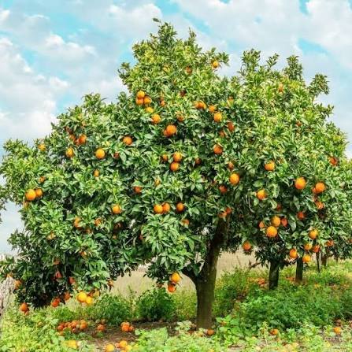

## Orange yield around the world

Found on the **ourworldindata.org**, the data set that we are using,
gives information about the yield of different countries, their year of
yield, plus the data set contains the code to the different part of the
world. The yield is in tonnes per hectare.

## Context

## Running Code

We will use the dataset created by the FAO, which lists orange yields by
country and year from 1961 to 2024.

```{r}
#| echo: false
orange <- read.csv(file='orange-yields.csv', sep=',', dec='.')
summary(orange)
```

## Possibility of usage

```{r}
#| echo: false
Orange_data <- read.csv("orange-yields.csv")
France_data <- Orange_data[Orange_data$Entity=="France",]
```

You can add options to executable code like this

```{r}
#| echo: false
2 * 2
```

The `echo: false` option disables the printing of code (only output is
displayed).

References : Dataset : Food and Agriculture Organization of the United
Nations (2025) – with major processing by Our World in Data. “Orange
yields – UN FAO” \[dataset\]. Food and Agriculture Organization of the
United Nations, “Production: Crops and livestock products” \[original
data\]. Retrieved September 16, 2026 from
https://archive.ourworldindata.org/20260910-011030/grapher/orange-yields.html
(archived on September 10, 2026).
