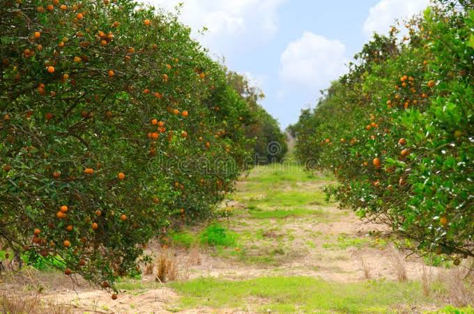

::: {#image-intro layout-ncol="2"}
{#fig-oranger
width="300px"}

{#fig-oranger width="300px"}
:::

## Orange yield around the world

Found on the **ourworldindata.org**, the data set (@dataset2025) that we
are using, gives information about the yield of different countries,
their year of yield, plus the data set contains the code to the
different part of the world. The yield is in tonnes per hectare.

## Context

## Running Code

We will use the dataset created by the FAO, which lists orange yields by
country and year from 1961 to 2024. Yield is, in this dataset, measured
in tonnes per hectare.

```{r}
#| echo: false
#| message: false
#| warning: false
library(dplyr)
orange <- read.csv(file='orange-yields.csv', sep=',', dec='.')
orange <- rename(orange, Yield_t_per_ha = Oranges...Yield..tonnes.per.hectare.)
summary(orange)

```

As The summary of the dataset shows, yield range from 0.2871 to 81.9037
tonnes per hecatres. This minimum is related to French Polynesia in 2023
and the maximum is related to Caribbean in 1983.

## The World's Largest and Smallest Orange Producers

```{r}
#| echo: false
#| message: false
#| warning: false
library(dplyr)
orange_countries <- orange %>%
  filter(!is.na(Code) & nchar(Code) == 3) # Keep only countries with a 3-character ISO code

# Calculate mean yields by country
country_means <- orange_countries %>%
  group_by(Entity) %>%
  summarise(
    Average_Yield = mean(Yield_t_per_ha, na.rm = TRUE)
  ) %>%
  rename(Country = Entity)

# Extract top 3 highest and bottom 3 lowest average yields
top_3 <- country_means %>%
  arrange(desc(Average_Yield)) %>%
  head(3)

bottom_3 <- country_means %>%
  arrange(Average_Yield) %>%
  head(3)


cat(
  "=============================================\n",
  "  TOP 3 COUNTRIES WITH HIGHEST YIELDS        \n",
  "=============================================\n",
  sep = ""
)
print(as.data.frame(top_3))

cat(
  "\n=============================================\n",
  "  TOP 3 COUNTRIES WITH LOWEST YIELDS         \n",
  "=============================================\n",
  sep = ""
)
print(as.data.frame(bottom_3))
```

Although this ranking isn't the most meaningful, we wanted to highlight
the top 3 best and worst orange producers in the world. This ranking
could be improved by reducing the number of years used to calculate the
average, since some countries, such as Guatemala, have only recently
become major producers.

Here is a comparison of Guatemala's production with the global average
to illustrate this point :

```{r}
#| echo: false
#| label: fig-example
#| fig-cap: "Comparison of Orange yield between Guatemala and the World"
#| eval: true

guatemala <- subset(orange, Entity == "Guatemala")
world <- subset(orange, Entity == "World")

plot(
  world$Year, world$Yield_t_per_ha,
  type = "l", col = "blue", lwd = 2,
  ylim = c(0, max(guatemala$Yield_t_per_ha, na.rm = TRUE) + 5),
  xlab = "Year", ylab = "Yield (tonnes per hectare)",
  main = "Orange Yield: Guatemala vs. World Average"
)

lines(
  guatemala$Year, guatemala$Yield_t_per_ha,
  col = "orange", lwd = 2
)

legend(
  "topleft",
  legend = c("Guatemala", "World"),
  col = c("orange", "blue"),
  lwd = 2
)

```

We can see in the @fig-example that the Guatemala stands above the rest
of the world. Even though it is only a mean of the orange world
production.

#What are the causes of this much disparity ?

We can see that the gap between the countries between the highest yield
countries and lowest yield countries are more than 25 t/ha. This gap can
be explained biologicaly, when looking at litterature, we know that
Citrus plants are tropical/subtropical crop, and even if they can
technically grow flowers, then produce fruits outside of their natural
habitats, climate will still affect the crops, Citrus crops are
vulnerable to cold and freezing, where youngs crops are dying at -12 °C,
the best results were found at a temperature between 23 °C and 34°C
(Amparo, 2021). Water will also need to be taken into account, as water
stress tends to induce the start of flowering (Subhrajyoti, 2023).
Yields will greatly depends on theses various factors linked to climate
and explain somes of the differences we see here.

## How are european yields evolving ?

```{r}
#| echo: false
Orange_data <- read.csv("orange-yields.csv")
europe_data <- orange[orange$Entity=="Europe",]
```

To make a connection to modeling, we decided to develop a model of
orange yields in France since 1961.

```{r}
lm_model <- lm(Yield_t_per_ha ~ Year, data = europe_data)
summary(lm_model)
```

The extremely low p-values (\<0.001) for Intercept and the Year variable
confirms that the evolution of European Yields can be modeled by a
linear regression. This model explains approximately 75% of the
variability in yields (R²=0.753), and the estimate for the Year variable
shows that yields tend to increase in Europe
($\hat{\beta}_1 \approx 0.133$).

```{r}
#| echo: false
#| label: fig-lm
#| fig-cap: "Orange Yield Trend in Europe"
#| eval: true
#| 
plot(
  europe_data$Year, europe_data$Yield_t_per_ha,
  type = "b", pch = 19, col = "darkblue",
  xlab = "Year", ylab = "Yield (tonnes per hectare)",
  main = "Orange Yield Trend in Europe"
)

# 4. Add linear regression line
abline(lm_model, col = "red", lwd = 2)

legend(
  "topleft",
  legend = c("European Yields", "Linear Model"),
  col = c("blue", "red"),
  pch = c(15, NA),
  lwd = 2
)
```

As can be seen, the figures @fig-lm illustrate the linear model, which
we already knew models an increasing trend in yields.

## Possibility of usage

As exposed by @MichaelIgolima2023ModifiedOP, the orange peel is able to
absorb heavy metal via bio-adsorption. This is a good option for the
future, seeing how much the orange production has increased. Seeing
@fig-oranger, we can imagine the potential in these orange peel, the
tree can get to 10m

### References :

::: {#refs}
:::
