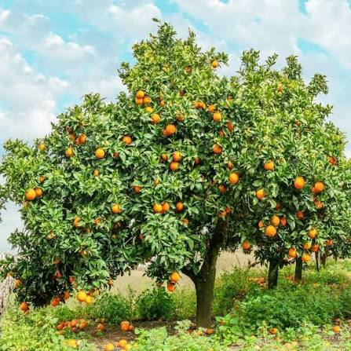

## Orange yield around the world

Found on the **ourworldindata.org**, the data set (@dataset2025) that we
are using, gives information about the yield of different countries,
their year of yield, plus the data set contains the code to the
different part of the world. The yield is in tonnes per hectare.

## Context

## Running Code

We will use the dataset created by the FAO, which lists orange yields by
country and year from 1961 to 2024. Yield is, in this dataset, measured
in tonnes per hectare.

```{r}
#| echo: false
orange <- read.csv(file='orange-yields.csv', sep=',', dec='.')
summary(orange)
```

As The summary of the dataset shows, yield range from 0.2871 to 81.9037
tonnes per hecatres. This minimum is related to French Polynesia in 2023
and the maximum is related to Caribbean in 1983.

## The World's Largest and Smallest Orange Producers

```{r}
#| echo: false
#| message: false
#| warning: false
library(dplyr)
orange_countries <- orange %>%
  filter(!is.na(Code) & nchar(Code) == 3) # Keep only countries with a 3-character ISO code

# Calculate mean yields by country
country_means <- orange_countries %>%
  group_by(Entity) %>%
  summarise(
    Average_Yield = mean(Oranges...Yield..tonnes.per.hectare., na.rm = TRUE)
  ) %>%
  rename(Country = Entity)

# Extract top 3 highest and bottom 3 lowest average yields
top_3 <- country_means %>%
  arrange(desc(Average_Yield)) %>%
  head(3)

bottom_3 <- country_means %>%
  arrange(Average_Yield) %>%
  head(3)


cat(
  "=============================================\n",
  "  TOP 3 COUNTRIES WITH HIGHEST YIELDS        \n",
  "=============================================\n",
  sep = ""
)
print(as.data.frame(top_3))

cat(
  "\n=============================================\n",
  "  TOP 3 COUNTRIES WITH LOWEST YIELDS         \n",
  "=============================================\n",
  sep = ""
)
print(as.data.frame(bottom_3))
```

Although this ranking isn't the most meaningful, we wanted to highlight
the top 3 best and worst orange producers in the world. This ranking
could be improved by reducing the number of years used to calculate the
average, since some countries, such as Guatemala, have only recently
become major producers.

Here is a comparison of Guatemala's production with the global average
to illustrate this point :

```{r}
#| echo: false
guatemala <- subset(orange, Entity == "Guatemala")
world <- subset(orange, Entity == "World")

plot(
  world$Year, world$Oranges...Yield..tonnes.per.hectare.,
  type = "l", col = "blue", lwd = 2,
  ylim = c(0, max(guatemala$Oranges...Yield..tonnes.per.hectare., na.rm = TRUE) + 5),
  xlab = "Year", ylab = "Yield (tonnes per hectare)",
  main = "Orange Yield: Guatemala vs. World Average"
)

lines(
  guatemala$Year, guatemala$Oranges...Yield..tonnes.per.hectare.,
  col = "orange", lwd = 2
)

legend(
  "topleft",
  legend = c("Guatemala", "World"),
  col = c("orange", "blue"),
  lwd = 2
)
```

## Possibility of usage

```{r}
#| echo: false
Orange_data <- read.csv("orange-yields.csv")
France_data <- Orange_data[Orange_data$Entity=="France",]
```

As exposed by @MichaelIgolima2023ModifiedOP, the orange peel is able to
absorb heavy metal via bio-adsorption. This is a good option for the
future, seeing how much the orange production has increased.

### References :

::: {#refs}
:::
